Pixel Lab I: Grayscale Image Processing
=======================================
This project is inspired by the CollegeBoard AP CS "Picture Lab" developed by Barbara Ericson of the Georgia Institute of Technology.  
**Points: 60 + 15 EC**

Introduction
------------
This lab  explores image processing by representing images as 2D arrays of pixels. You will be able to read in images, manipulate them by modifying the 2D arrays, and then display or save the modified images. Working on this lab will give you practice applying all the computer science concepts you have learned so far to the important domain of image processing.
  
**Prerequisites**: the ability to define and modify 1D and 2D arrays of integers; understanding conditionals and loops.

Background
----------
A digital image is a 2D array of pixels. Each pixel is a small square of a uniform color. When viewed from a distance, the individual pixels appear to merge into a continuous image.

A pixel's color is often represented as a triple of numbers, (r, g, b), representing the amount of red, green and blue in the image. The range of values allowed for each number is [0,255], with 0 representing no color and 255 representing the maximum possible value of that color. Thus, the triple (255, 0, 0) represents "pure" red, (0, 255, 0) represents "pure" green, and (0, 0, 255) represents "pure" blue.  (Side note: the range [0, 255] represents 256 different values. This is the exact number of distinct values that can be represented in 8 bits, which is 1 byte. This allows an (r,g,b) triple representing a single pixel to be packed into 3 bytes.)

In this first Pixel Lab, we will restrict ourselves to "grayscale" images – images that are monochrome and range from black, through a series of grays, to white. Gray level can be represented by a single integer in the interval [0, 255].

Since a grayscale pixel can be represented by a single integer, the entire grayscale image can be represented by a 2D array of integers. Specifically, the integer at row i and column j in the 2D array represents the gray level of the pixel located i pixel rows down and j pixels to the right from the top left corner of the image.

For example, the array:

    int[][] arr = {
        {0,   50,  100},
        {150, 200, 250}
    };

represents the grayscale image below (shown greatly magnified so that each pixel looks like a little square).

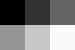

 
This tiny image is only 3 pixels wide and it has 2 rows, directly corresponding to the two rows of the array.

Representing a grayscale image as a 2D array of integers provides enormous opportunity for image analysis, synthesis and manipulation. For example, the problem of detecting a face in an image transforms into a problem of detecting a pattern in a 2D array of numbers using various mathematical techniques. Blurring an image (one of the activities in this this lab) consists of averaging the pixel values in the neighborhood of each pixel.  

Activity 1: Understand the initial project sample
-------------------------------------------------
This lab uses the Processing library from <https://www.processing.org>. The proper Processing library for Java has been included for you in this project - for more information, visit the link above and dig in!

Open project PixelLabOne. The project has two classes, `Program` and `PixelLab`. You will write all your code as methods added to the `Program` class. The `PixelLab` class contains methods to load, save and display images, and will remain unchanged in this project.

Compile and run the program. The relevant code for this activity is in the `Program` method `introActivity()`. Verify that it is working properly and become familiar with the basic flow of control. Demonstrate your findings by answering the questions below.

1.  Do two identical "checkerboard style" grayscale (black & white) image get displayed on the screen?
 
2.  Which `Program` method creates a 2D array that defines the pattern that makes up the left image?  

3.  What `PixelLab` method causes the image to be displayed on screen? What are the meaning of the last two parameters (both type `int`) of this method?

4.  Has the file **foo.png** been created under the images project subdirectory? What `PixelLab` method caused that file to be created?

5.  What `PixelLab` method causes the second image to be read into a 2D array? Why is there a double backslash in the filename string?

6.  Identify the lines of code that causes the second (right) image to be darker than the first. Write out by hand, in full, the code that produced that change. Reflect on how it produces the darkening effect.

Cut and paste these questions into OneNote, and submit them and your answers under the Homework tab in a new page titled "PixelLab - Activity One".  *Please use this naming scheme to make it easier for us to grade.*

Comment out the `introActivity()` method call in the `draw()` method of the `Program` class once you've completed this activity.  

Activity 2: Striping images
---------------------------
In this activity, you will experiment with modifying parts of an image by passing individual rows of the 2D array representing the image into a method that modifies a 1D array of integers. This will give you experience treating a 2D array as an array of 1D arrays (which, in fact, it is), and also with methods that modify arrays "in place."

The end goal of this activity is to darken horizontal stripes of an image. For example, the image below left is the original image; the image to the right has been "striped" (the input image was converted to grayscale when it was loaded).

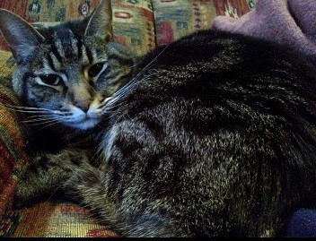 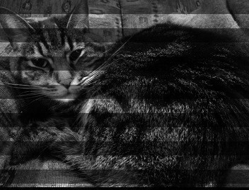

**Implementation Steps**

1.  In the `Program` class, just under the `stripeActivity()` method, write a new method called `scalarMultiply()` that takes two parameters:
    - a 1D array of integers, and
    - a double parameter called `factor`.  
  The method modifies the elements of the array by multiplying each of the elements of the array by factor, discarding any fractional portion after the multiplication.  Test this method by calling it from main with a small integer array and printing out the results. For example, if the input array is {2, 3, 4} and factor is 0.5, the array's elements should be {1, 1, 2} after the call to `scalarMultiply()`. Remember that the method modifies the array in place; it does not return anything.  Once your `scalarMultiply()` method is working correctly, remove your test code from main.
2.  Select an image of your choice to be an input image. It should preferably not be larger than about 500x500, though you should feel free to experiment with larger images (how many pixels does a 500x500 image have?).  Save this image in your project's `images` folder.
3.  Use a `PixelLab` method to load the image into a 2D array and display it (it will display as a grayscale image even if the original image is in color). This code goes into the `stripeActivity()` method of the `Program` class.
4.  Write a method call `stripeImage()` that takes a 2D `int` array and modifies it in place, darkening horizontal strips of the image as illustrated above. This method must call the `scalarMultiply()` method you wrote earlier. The trick is to call it only selectively, so that the stripe pattern forms (if you were to call it on every row the entire image would be darkened).  
*Hint*: consider dividing the row index by a constant value, such as 20 (and it is good practice to define this "magic number" as a class constant). Can you use the result of this division to decide whether or not to stripe every alternate band of rows?
5.  In the `stripeActivity()` method of the `Program` class, write code to display the 2D array after calling `stripeImage()`. It should display the stripe pattern.

Save the result in your `images` folder to an output file called stripeOutput.JPG, and submit the output images to GitHub as part of your submission.  

Comment out the `stripeActivity()` method call in the draw method of the `Program` class once you've completed this activity.  

Activity 3: Blending two images
-------------------------------
In this activity, you will write code that blends two input images into a single output image.  This activity will give you experience writing methods that take in multiple arrays as input, and also create and return an entire array. Blending images can be a lot of fun, depending on which images you choose to blend!

You will create two versions of the blending code. The first (simpler) version is a uniform blend of the two images: each pixel in the output image is the average of the corresponding pixels in the input image. For example, the two input images on the top row below are uniformly blended into the lower image.

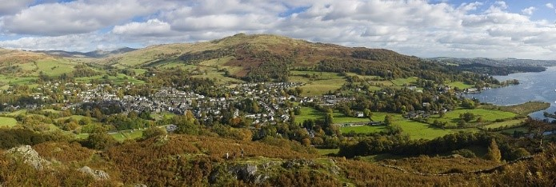  
Image credit: [by Diliff - Own work, CC BY-SA 3.0](https://commons.wikimedia.org/w/index.php?curid=8316780)

  
Image credit: [by Guillaume Piolle /, CC BY 3.0](https://commons.wikimedia.org/w/index.php?curid=9936111)

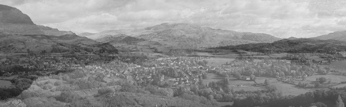  
 
The second version does progressive blending from left to right, starting out (left edge) primarily as the first image and ending up (right edge) being primarily the second image. The image below demonstrates progressive left-to-right blending of the two input images above. Contrast it to the uniformly blended image above.

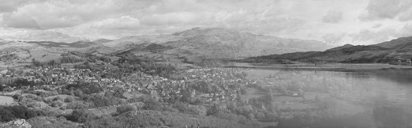
 
The two images used in the example are [cumbria.jpg]((https://commons.wikimedia.org/w/index.php?curid=8316780) and [localsh.jpg](https://commons.wikimedia.org/w/index.php?curid=9936111), both available under the `images` directory of the project.  For the final blended image, you should pick your own images.

**Implementation Steps**

1.  Pick two new images of your own choice to blend. They should be similar in size to each other (though they do not need to be identically sized, as we explain later). Where should you save these images?
2.  In the `blendActivity()` method, write code to load and display the two images, just to make sure that there are no issues with loading the input images.
3.  Just below the `blendActivity()` method, write a new method called `uniformlyBlend()` that takes two input images (two 2D `int` arrays, each representing one input image) and returns a 2D `int` array representing the blended image.

    The method must first allocate an array to contain the blended image. The dimension of this array must be decided with some care, because the input arrays may not have identical dimensions. The returned array should have dimensions just large enough to fit the smaller of the two images in either dimension. For example, if the input arrays have dimensions 100x200 and 150x150, the output 2D array size should be 100x150.  

    How can you determine the width and height of a 2D array?  

    Next, iterate over all pixels using a nested for loop, setting each blended pixel to the average of the corresponding pixels from the two input images.  

4.  Call `uniformlyBlend()` from `blendActivity()`, passing the two input arrays and save the resultant blended array into a file called uniformBlendOutput.jpg in your `images` folder.

5.  Just after the `uniformlyBlend()` method, create a second blending method called `leftToRightBlend()` that has the same signature as `uniformlyBlend()`, but performs a left-to-right blend as illustrated earlier. Call this method from `blendActivity()`, creating and saving this version of the image to file leftToRightBlendOutput.jpg in your `images` folder.

    The fractional contribution of the first and second image depends on the column number. Therefore, compute a fraction (say frac) that depends on the column index. This fraction starts out as 0 when the column index is 0 and becomes 1.0 when the column index is at its maximum value (representing the right-most column). This fraction can be used in the expression that blends pixels from the two image sources according to the following expression: `(1.0 – frac)*pix1 + frac*pix2`, where pix1 is a pixel from the first input image and pix2 is the corresponding pixel from the second input image. Remember that grayscale pixel values are `int` values, so use casting where appropriate.

Make sure you submit your source and final blended images as part of your GitHub submission.  
    
Activity 4: Posterizing an image
--------------------------------
Posterization is the conversion of gradation of colors or tones in an image into larger regions with fewer tones, resulting in sharper, more abrupt changes between tones.  Originally done to handle printing colors on posters, the deliberate application of the technique to images can lead to interesting visual effects.

An example of posterization can be seen below - posterization can be easily seen in the shadows under and above the snake, in it's nose, and behind the head. 
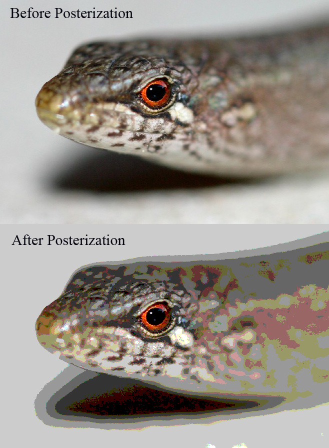  
Image credit: [by Diliff - Own work, CC BY-SA 3.0](https://upload.wikimedia.org/wikipedia/commons/c/cf/Posterization_example.jpg)

You will effect posterization on an grayscale image of your own choosing, reducing the number of levels from 256 to 64, 32, and 16, and saving each resulting file. 

**Implementation Steps**

1.  Pick a new images of your own choice to posterize.  Where should you save these images?
2.  In the `posterizeActivity()` method, write code to load and display the image, just to make sure that there are no issues with loading the input image.
3.  Just below the `posterizeActivity()` method, write a new method called `posterize()` that takes an input image (a 2D `int` array, representing the input image) and an `int` representing the number of levels, and returns a new 2D `int` array representing the posterized image.

    The method must first allocate an array to contain the posterized pixels. The dimension of this array should match the dimensions of the source array.
    
    The method should also define the ranges for each level in the posterized image.  As an example, consider an image posterized to just two levels - black and white.  
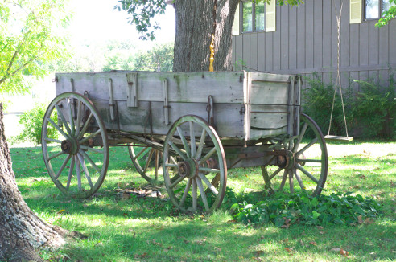 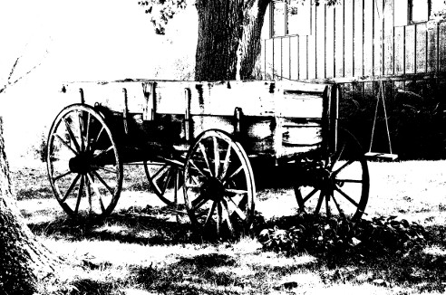

    In this example, two levels were specified, so the ranges were calculated to be 0-127, and 128-255.  Every pixel in the image was mapped to one of these levels.
    
    The method also needs to define the final output color for each level.  For our purposes, the first level should always output color 0 (black), and the last level should always output color white (255).  The remaining levels should be evenly distributed between those two values.  For example, if levels=4, your four output colors should be 0, 85, 170, and 255.  In the example above, the output colors were 0 (black) and 255 (white). 

    Once you have your level intervals and output values defined, iterate over all pixels, setting each output pixel to the value of the level to which the input pixel belongs.  

4.  Call `posterize()` from `posterizeActivity()`, passing the input array and level, and save the resultant posterized image into a file called posterizeOutput-level<level>.jpg, where <level> is the number of levels.  You should call `posterize()` four times with the same image at four different levels:  64, 32, 16, and 4.

Make sure you submit your source and final output images as part of your GitHub submission.  

Extra Credit Activity: Blurring Images
--------------------------------------
A sharp image can be made "blurry" by replacing each pixel by an average of itself and its neighboring pixels. This activity provides additional experience with image processing algorithms and working with more complex sub-regions of an array.

Write a method called `blurImage()` that takes a 2D int array representing an image and returns a copy of the array that represents a blurry version of the input image (the input array must not be modified by the method). The blurring is done by setting each pixel in the new array to the average of all the pixels in a block (for example, an 11x11 pixel area) centered on the pixel to be blurred. This covers pixels within +/- 5 of the pixel in both the x and y directions. The larger the block that is involved in the averaging, the blurrier the image gets. The image below right was blurred using a 11x11 pixel averaging area.

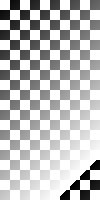 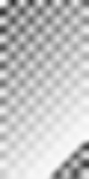

*Warning*: pixels close to the image edges will not have the entire block of pixels to average, so be sure to only include valid pixel locations when computing the average. Optional: make the size of the block the second parameter to `blurImage()` (so passing 11 as the 2nd parameter produces a 11x11 block over which to compute the average) and experiment with varying this parameter.

Implementation steps are left open ended, as long as the code is able to blur an image read from an input file, display it on the screen and write out the modified file.  Your output image should be named blurOutput.jpg.

Make sure you submit your source and final output images as part of your GitHub submission.  

Grading
-------
There are 50 total points available, plus 5 extra credit points.  Grading will be based on the following rubric:

**Functional Correctness**
- **5 points**: Activity 1 questions answered (cut/paste the questions and your answers into OneNote)  
- **5 points**: You have picked your own input images (not the ones supplied by the project)  
- **5 points**: Methods have the proper signature and the correct return values  
    - **1 point**: `scalarMultiply()`
    - **1 point**: `stripeImage()`
    - **1 point**: `uniformlyBlend()`
    - **1 point**: `leftToRightBlend()`  
    - **1 point**: `posterize()`  
- **20 points**: Methods function properly
    - **4 points**: `scalarMultiply()`
    - **4 points**: `stripeImage()`
    - **4 points**: `uniformlyBlend()`
    - **4 points**: `leftToRightBlend()`
    - **4 points**: `posterize()`
- **5 points**: Output images generated (and submitted to GitHub) for each of the activities

**TOTAL: 40 points**

**Coding Style**
- **4 points**: Readability: Indentation
- **4 points**: Readability: Meaningful method and variable names.
- **4 points**: Readability: Comments/Documentation.
- **4 points**: Efficiency: Code duplication.
- **4 points**: Efficiency: Smart algorithm.

**TOTAL: 20 points**

**EXTRA CREDIT**
- **1 points**: You have picked your own input image.
- **2 point**: `blurImage()` method has the proper signature
- **10 points**: `blurImage()` method functions properly
- **2 points**: Output images generated (and submitted to GitHub) for this activity.

**TOTAL: 15 points**